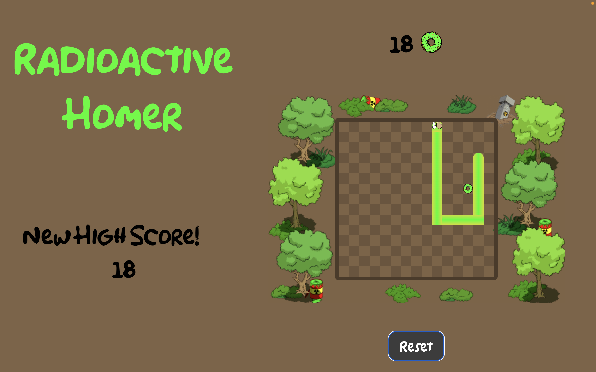

 
 

# Radioactive Homer

## Intro
This game has the same mechanics and gameplay as the classic 1970s arcade game "Snake" but with a visual style and theme inspired by the iconic tv animation, The Simpsons. The goal is to guide Homer (i.e., the snake) to donuts while avoiding collisions with walls and his own body. But be careful because the donuts are radioactive so Homer's body mutates as he consumes more.
 
 

## [Play the game here](https://homer-snake-game.netlify.app)
- Use arrow keys to direct Homer and change direction. 
- The difficulty level increases as Homer gets longer and moves faster with every donut he eats.
- This game is optimized for desktop displays. 
- Audio automatically plays once the game is in progress.
 
 

## Attributions
- The Simpsons. Created by Matt Groening, produced by Gracie Films and 20th Television, from 1989 to today.
- [Homer sounds](https://www.soundboard.com) 
- [The Simpons theme song](https://www.101soundboards.com)
- Font by [Dennis Ludlow](https://www.sharkshock.net)
- Background Images from [here](https://simpsonstappedout.fandom.com) and [here](https://www.seekpng.com/ipng/u2w7e6r5i1q8q8w7_radiation-figure-toxic-waste-clipart/)
- [Homer's face](https://steamcommunity.com/sharedfiles/filedetails/?id=1919876438)
- [Donut Image](https://www.kindpng.com/imgv/wmRwTT_transparent-donuts-clipart-simpsons-donut-hd-png-download/)

 
 

## Technologies

- JavaScript
- HTML
- CSS
- Git
 
 

## Future Enhancements
- Mobile friendly
- Retain high score across visits
- Add shadow to snake and donut
- Improve donut resolution
- Homer's mouth opens when it gets closer to the donut
- Animate glow feature once player passes high score
